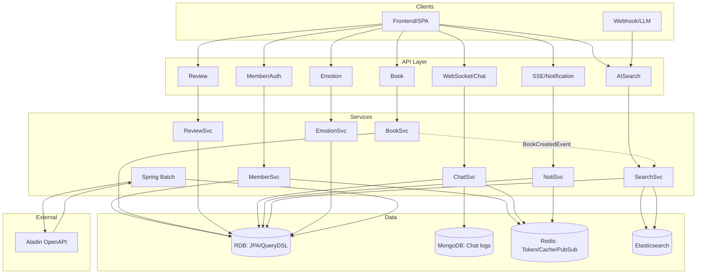

# 🎲 Moodbook

## 🕰️ 진행 기간
♠︎ **2025. 7. 3 ~ 2025. 7. 28** ♠︎

<br/>

## 📖 프로젝트 기획

- 기존 도서 플랫폼은 키워드 중심 검색에 의존
- 사용자의 감정 상태나 정서적 맥락을 반영하지 못함
- **'감정 선택 -> 도서 추천 -> 검색어 시각화 -> 히스토리 기록'** 의 흐름을 통해 사용자의 도서 검색 효율 향상


<br/>

## 🧐 새로운 추천 흐름

- 감정 태그 클릭 (최대 5개까지 가능)
- 사용자 감정에 기반한 도서를 추천 받음
- 사용자는 감정에 맞는 도서를 추천받음으로써 감정 흐름을 따라가는 몰입형 독서 경험을 설계할 수 있음


<br/>

## 👨‍💻 문제 인식 및 해결 방안

- 사용자가 추천한 도서를 통해 독후감 작성 및 독서모임에 참여할 수 있음
- 단순한 도서 서비스를 제공받는 것이 아닌 서로가 공감하며 책의 내용을 공유할 수 있는 환경 제공


<br/>

## 🧭 ERD


<br/>

## 📜 API 명세서

- 링크: https://documenter.getpostman.com/view/31353886/2sB34mhxma#8b0aed3b-14db-4dac-a541-a902374c5d2c


<br/>

## 🏗️ 시스템 아키텍처

### 전반적인 흐름 구성도



### CI/CD 구성도


<br/>

## 🛠️ 기술 스택

| 구분               | 기술/도구                                                             |
| ---------------- | ----------------------------------------------------------------- |
| **Frontend** | React, TypeScript, Styled-components, React-router |
| **Backend** | Java 17 (LTS), Spring Boot 3.5.3, Spring Security, JPA, QueryDSL, H2        |
| **DataBase**       | MySQL, MongoDB 7.0, Redis, ElasticSearch |
| **Main Tech Stack**       | WebSocket, STOMP, Redis Pub/Sub                                |
| **DevOps**        | Docker, Github Actions, Jenkins, Grafana, Prometheus, Discord, ELK(ElasticSearch + Logstash + Kibana), AWS(S3, RDS, EC2), ElasticCache, Nginx  |

<br/>

## 📁 프로젝트 구조

```
moodbook-backend/
 ├── src/main/java/com/moodbook
 │    ├── domain
 │    │    ├── member
 │    │    ├── book
 │    │    ├── review
 │    │    ├── bookmark
 │    │    ├── chat
 │    │    └── notification
 │    ├── global
 │    │    ├── config
 │    │    ├── exception
 │    │    └── security
 │    └── MoodbookApplication.java
 │
 ├── src/main/resources
 │    ├── application.yml
 │    └── static / templates
 │
 ├── build.gradle
 └── docker-compose.yml
```


